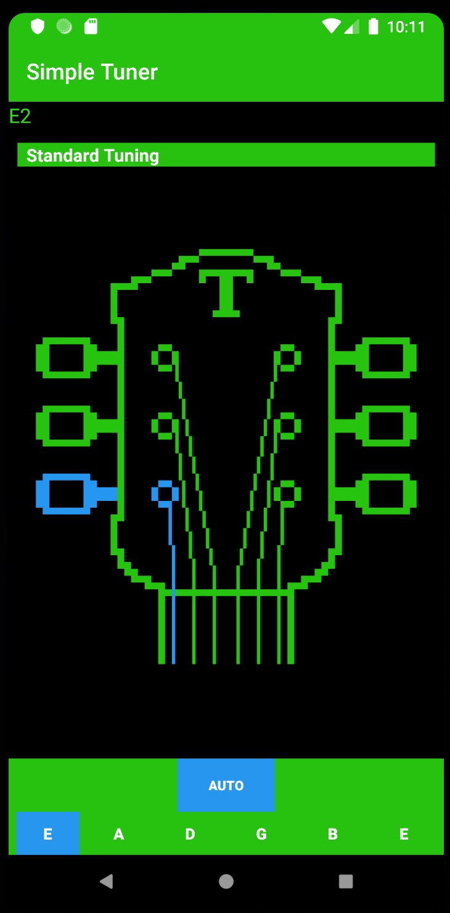

# Simple Tuner

Simple tuner app for guitar.
Utilizes AAudio high performance audio API for Android.
Will only run on Android 8 and higher.

Manual mode allows playing of notes using oscillator.
Auto mode allows note detection through microphone.

Algorithm for note matches inspired by method seen here: https://github.com/jbergknoff/guitar-tuner
