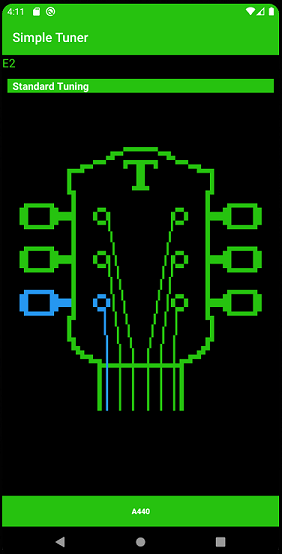

# Simple Tuner

 

Simple Tuner is a simple Android app for guitar tuning.
It utilizes AAudio high performance audio API for Android (will only run on Android 8 and higher).

The tuner will identify a note being played into the microphone and highlight the corresponding
guitar string if it matches a note within the user selected tuning. Additionally, the app allows
playback of an A440 (concert A) sine wave for reference.

Algorithm for note matches inspired by method seen here: https://github.com/jbergknoff/guitar-tuner
